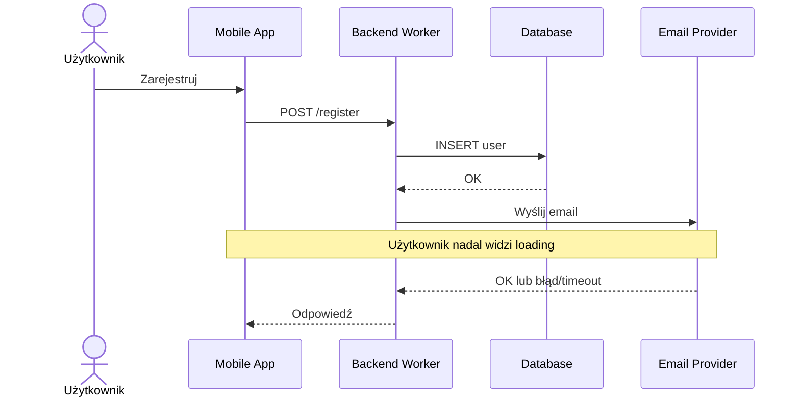
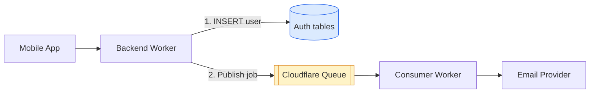
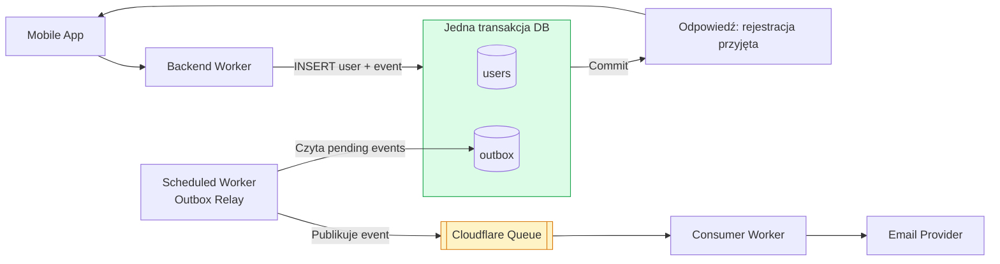
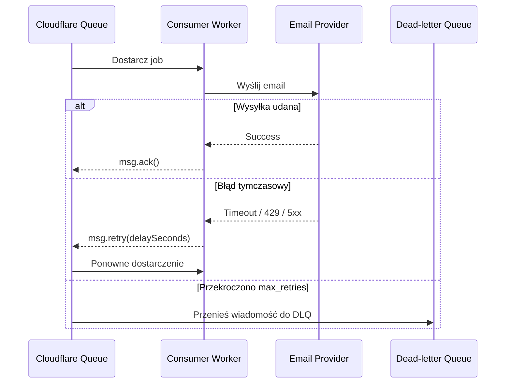
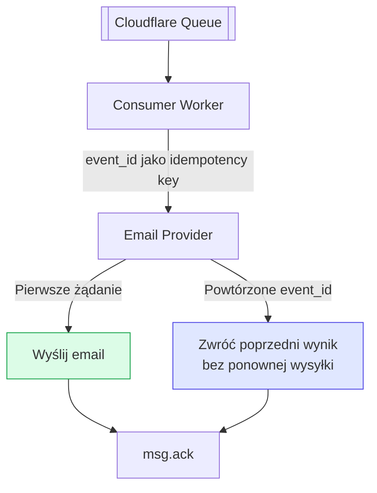
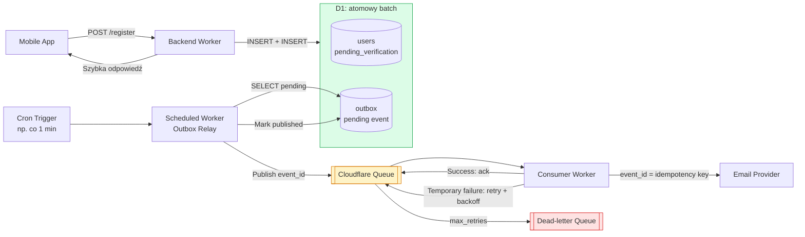

# System design: rejestracja użytkownika z emailem weryfikacyjnym

## Założenia

Po rejestracji konto otrzymuje status `pending_verification`. Użytkownik powinien szybko dostać odpowiedź z API, a chwilowa awaria dostawcy emaila nie powinna wymuszać ponownej rejestracji.

## I. Synchroniczna wysyłka emaila

Backend zapisuje użytkownika, wysyła email i dopiero wtedy odpowiada aplikacji.



**Problem:** dostawca emaila może odpowiadać przez 10 sekund, zwrócić błąd albo wcale nie odpowiedzieć. Zewnętrzny efekt uboczny, który nie jest potrzebny do odpowiedzi HTTP, powinien być background jobem.

Nie warto również wysyłać emaila wewnątrz transakcji bazodanowej. Transakcja nie obejmuje dostawcy emaila i nie potrafi cofnąć już wysłanej wiadomości. Długie wywołanie sieciowe niepotrzebnie przedłuża też transakcję.

## II. Asynchroniczna wysyłka przez kolejkę

Backend zapisuje użytkownika i publikuje job do Cloudflare Queue. Osobny consumer Worker wysyła email.



**Problem: dual write.** Backend wykonuje dwa niezależne zapisy. Zapis użytkownika może się udać, a publikacja do kolejki może zawieść. Konto istnieje, ale job odpowiedzialny za email przepadł.

Rozdwojenie przepływu na dwa niezależne systemy powinno od razu skłaniać do sprawdzenia scenariuszy częściowego sukcesu.

## III. Transactional outbox

Backend zapisuje użytkownika i zdarzenie `SendVerificationEmail` do tabeli `outbox` w jednej transakcji bazodanowej. Oba rekordy powstają albo nie powstaje żaden.



Przykładowy rekord outbox:

```text
event_id:   018f...                 # UUID/ULID utworzone przed transakcją
event_type: SendVerificationEmail
payload:    { userId, email, verificationToken }
status:     pending
created_at: ...
published_at: null
```

`event_id` jest stałym identyfikatorem zdarzenia. Ten sam identyfikator trafia później do wiadomości w kolejce i służy jako idempotency key.

### Implementacja na Cloudflare

W D1 można użyć `DB.batch([insertUser, insertOutbox])`. D1 wykonuje taki batch jako transakcję i cofa całą sekwencję, jeśli jedna instrukcja zawiedzie.

`batch()` wystarcza, gdy instrukcje można przygotować z góry, na przykład po wygenerowaniu `user_id` oraz `event_id` w aplikacji. D1 nie udostępnia jednak typowej, interaktywnej transakcji, w której aplikacja wykonuje zapytanie, analizuje wynik i na tej podstawie wykonuje kolejne zapytania w tej samej transakcji. Przy wielu takich przypadkach lepszym wyborem może być Postgres albo SQLite-backed Durable Object, jeśli dane można naturalnie podzielić między obiekty.

Outbox Relay może być Scheduled Worker uruchamiany przez Cron Trigger. Dobrym punktem startowym jest **co minutę**. Interwał można zwiększyć do 2-5 minut, jeśli opóźnienie emaila jest akceptowalne, albo zastosować częstszy/inny mechanizm, jeśli minuta to zbyt długo.

Relay wykonuje następujące kroki:

1. Pobiera niewielką partię rekordów `pending` z `outbox`.
2. Publikuje każdy rekord do Cloudflare Queue wraz z jego `event_id`.
3. Po udanej publikacji ustawia `published_at`.

Publikacja do kolejki i aktualizacja `published_at` nadal nie są jedną transakcją. Jeśli relay opublikuje wiadomość i padnie przed aktualizacją rekordu, opublikuje ją ponownie. To jest bezpieczne dopiero wtedy, gdy cały dalszy przepływ toleruje duplikaty.

## IV. At-least-once delivery i retry

Cloudflare Queues zapewnia dostarczenie **at least once**. Consumer potwierdza wiadomość dopiero po udanej obsłudze.



W Cloudflare consumer może:

- wywołać `msg.ack()` po sukcesie,
- wywołać `msg.retry({ delaySeconds })` po błędzie tymczasowym,
- pozwolić, aby nieobsłużony błąd spowodował retry,
- po przekroczeniu `max_retries` skierować wiadomość do skonfigurowanej DLQ.

Retry powinien mieć opóźnienie, najlepiej exponential backoff. Błędy trwałe, na przykład niepoprawny adres email, nie powinny być ponawiane bez końca.

**Problem:** dostawca może przyjąć email, po czym Worker straci połączenie, zostanie zatrzymany albo nie zdąży wykonać `ack()`. Kolejka dostarczy job ponownie i email może zostać wysłany drugi raz.

## V. Idempotentne przetwarzanie

Nie zakładamy, że job zostanie wykonany dokładnie raz. Zakładamy, że może zostać dostarczony wiele razy, a ponowne przetworzenie ma nie powodować nowych skutków.



### Gdzie przechowywać `job_id`

Źródłem identyfikatora jest `outbox.event_id`. Nie generujemy nowego ID przy każdym retry ani przy ponownej publikacji. Ten sam `event_id` przechodzi przez cały system:

```text
outbox.event_id -> queue message.event_id -> provider idempotency key
```

Dla efektów wykonywanych we własnej bazie można prowadzić tabelę:

```sql
CREATE TABLE processed_jobs (
    event_id TEXT PRIMARY KEY,
    processed_at TEXT NOT NULL
);
```

Unikalny klucz chroni przed równoległym przetworzeniem tego samego zdarzenia. Zapis do `processed_jobs` powinien być częścią tej samej transakcji co lokalny efekt danego joba.

### Idempotency key u dostawcy emaila

Jeśli API dostawcy obsługuje idempotency keys, Worker przekazuje `event_id` w wymaganym nagłówku lub polu żądania. Dostawca trwale kojarzy klucz z pierwszym żądaniem i przy powtórzeniu nie wysyła kolejnego emaila.

Sama lokalna tabela `processed_jobs` nie daje pełnej gwarancji dla zewnętrznego emaila:

- zapis ID przed wysyłką może sprawić, że po awarii email nigdy nie zostanie wysłany,
- zapis ID po wysyłce pozostawia możliwość duplikatu, jeśli Worker padnie pomiędzy tymi operacjami.

Jeśli dostawca nie obsługuje idempotency key, nie da się atomowo połączyć jego API z własną bazą. W praktyce akceptujemy rzadki duplikat, używamy w obu wiadomościach tego samego tokenu weryfikacyjnego i dbamy, aby endpoint weryfikacji także był idempotentny.

## Docelowa architektura



Ostateczna gwarancja brzmi: **atomowy zapis użytkownika i zamiaru wysłania emaila, at-least-once delivery oraz idempotentne przetwarzanie**. Nie jest to prawdziwe exactly-once delivery, ale system nie gubi jobów i bezpiecznie odzyskuje się po typowych awariach.

Warto dodatkowo zapewnić użytkownikowi opcję „Wyślij email ponownie” oraz monitorować wielkość backlogu, liczbę retry, wiek najstarszego rekordu outbox i wiadomości trafiające do DLQ.
